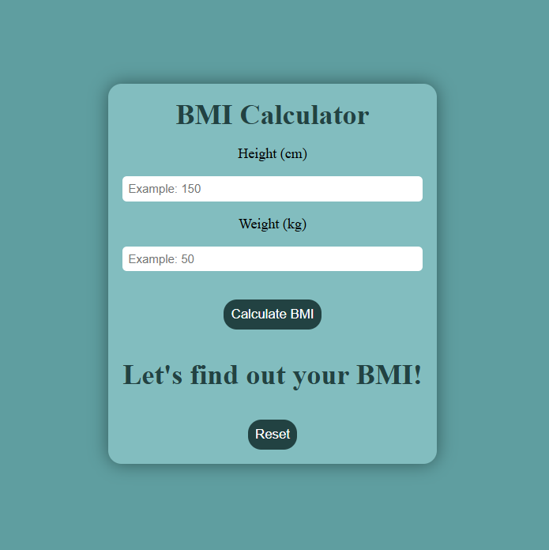
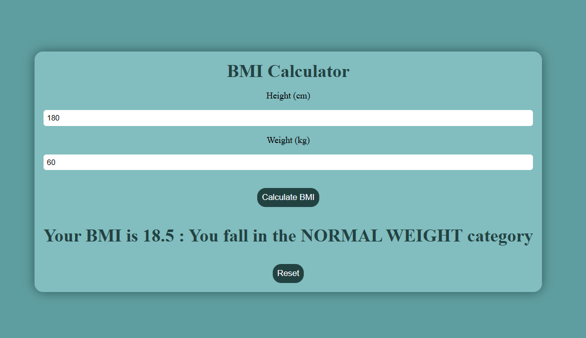

# BMI Calculator

This is an application made using React and Vite.

This application takes the input of the user's height and weight and calculates their BMI. 

The user is also given the category their BMI falls under.

### This is the home page of the app

### This is what happens once the user inputs their values

#### To do list:
- Allow imperial unit inputs
